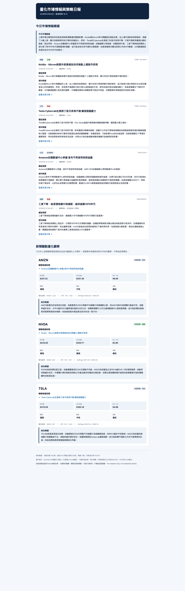

# Financial Market Intelligence & Quantitative Signal Pipeline

An auditable Python pipeline that converts financial-news feeds and market-price
history into cleaned evidence, deterministic technical indicators and a structured
market-intelligence report.

> **Status:** Working portfolio project with reproducible offline sample mode  
> **Role:** Personal project — pipeline design, implementation, validation and documentation

## Project Outcome

The pipeline produces four complementary outputs from one run:

- a browser-readable HTML market report;
- structured JSON for traceability;
- a CSV table of calculated indicators;
- a SQLite database for historical storage and later analysis.

### Example daily report



The report combines selected source-linked news, an evidence-limited market summary,
validated ticker references and deterministic technical observations in one readable
Traditional Chinese output. Numeric indicators are calculated in Python; AI is used
only for translation, summarisation and explanation.

A bundled sample mode runs without network access or API credentials. Its articles
and price histories are fictional demonstration data and are clearly separated from
live market information.

## Why I Built It

Market reports can become difficult to audit when data collection, calculations and
AI-generated commentary are mixed together. This project separates those stages so
that numeric values are calculated by Python, source records retain their provenance,
and the optional language model is limited to explaining supplied evidence.

## Pipeline Architecture

```text
RSS feeds or sample articles
            │
            v
   Clean and deduplicate
            │
            v
 Validate ticker references ──> Market-price history
            │                          │
            └──────────────┬───────────┘
                           v
              Deterministic indicators
                           │
                           v
          Rule-based market observations
                           │
              ┌────────────┴────────────┐
              v                         v
    Optional LLM explanation     Deterministic fallback
              └────────────┬────────────┘
                           v
                  Schema validation
                           │
             ┌─────────────┼─────────────┐
             v             v             v
          HTML/JSON        CSV         SQLite
```

## Main Features

- Cleans HTML, canonicalises URLs and removes duplicate articles.
- Preserves source, URL, publication time and ingestion time for each record.
- Validates extracted tickers against a controlled local universe.
- Calculates SMA200, RSI14, MACD, ATR14 and Bollinger Bands in Python.
- Uses fixed descriptive rules for trend, momentum and volatility classifications.
- Generates formula-based reference levels without asking an LLM to invent prices.
- Validates generated narratives with strict Pydantic schemas.
- Falls back to deterministic reporting when no LLM key is configured.
- Saves each run to JSON, CSV and SQLite and produces an escaped HTML report.
- Includes tests for cleaning, ticker validation, indicators, schemas, delivery and
  LLM fallback behaviour.

## Technical Design

The optional LLM receives only cleaned articles, verified tickers, calculated values
and rule-based observations. It cannot replace the numerical calculation layer or
override the fixed assessment. Invalid, incomplete or inconsistent model responses
are rejected by post-validation.

The pipeline also applies explicit data checks, including minimum price-history
length, OHLC consistency, finite numeric values, request timeouts, bounded retries
and per-source ingestion status.

## Technology Stack

| Area | Technology |
|---|---|
| Language | Python 3.11+ |
| Validation | Pydantic |
| Analysis | Deterministic technical-indicator modules |
| Inputs | RSS/Atom feeds, market chart data, offline samples |
| Storage | JSON, CSV, SQLite |
| Reporting | Escaped HTML |
| AI layer | Optional OpenRouter-compatible LLM |
| Automation | GitHub Actions |
| Quality | pytest test suite, structured logging and fallback handling |

## Reproducible Sample Run

```bash
python3 -m venv .venv
source .venv/bin/activate
python -m pip install -e ".[dev]"
pytest
python -m market_intelligence.main --sample
```

The sample run requires no API key and writes:

```text
outputs/latest_report.html
outputs/latest.json
outputs/latest_indicators.csv
outputs/market_intelligence.sqlite3
```

Example outputs from the bundled fictional sample dataset:

- [HTML market report](assets/sample-market-intelligence-report.html)
- [Structured JSON](assets/sample-market-intelligence.json)
- [Indicator CSV](assets/sample-market-indicators.csv)

A saved [HTML example of the generated daily report](assets/live-market-report-2026-10-04.html)
is also included for portfolio review. Linked publisher articles remain the property
of their respective sources.

## Security and Responsible Use

- Secrets are read from environment variables and are excluded from Git.
- No API key, email password or personal identifier is included in this case study.
- Untrusted article and model text is escaped before HTML rendering.
- Email delivery is optional and activates only when all required settings exist.
- Public feeds are used without bypassing paywalls or collecting subscriber-only text.

## Limitations

- The bundled ticker universe is intentionally small and US-focused.
- Public feeds and chart endpoints do not provide production availability guarantees.
- Indicators describe historical inputs; they are not forecasts.
- Corporate actions, survivorship bias, transaction costs and execution assumptions
  require further work before the project could support strategy research.

## Repository Note

This repository is the public project overview. Operational credentials and private
delivery configuration are not published. The project is for research and portfolio
demonstration only and does not provide investment advice.
